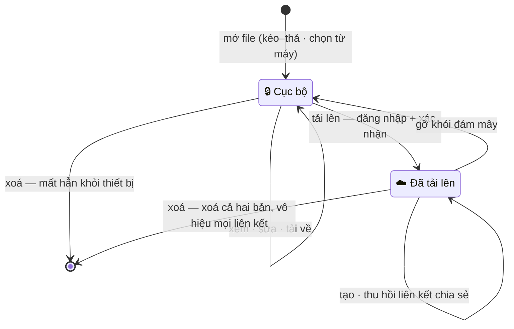
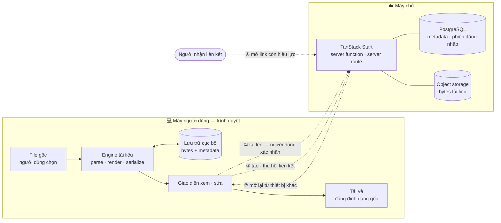

# Kiến trúc

> Tài liệu đi qua những trạng thái nào, và ranh giới nào nó không tự vượt qua.
> Xem [`../CLAUDE.md`](../CLAUDE.md) để biết sản phẩm này _là gì_, [`TECHSTACK.md`](TECHSTACK.md) để biết nó được dựng bằng gì.

**Hiện trạng:** `src/` mới là scaffold — chưa mảnh nào dưới đây có code. Hai sơ đồ ở đây mô tả phần đã chốt ở **tầng sản phẩm**: chúng đúng bất kể sau này chọn engine tài liệu hay object storage nào.

---

## 1. Vòng đời trạng thái tài liệu

Ba bất biến sơ đồ này áp đặt lên code:

| Bất biến                                                                                    | Vì sao                                                                                           |
| ------------------------------------------------------------------------------------------- | ------------------------------------------------------------------------------------------------ |
| Không có cạnh **tự động** nào từ Cục bộ sang Đã tải lên                                     | Mọi lần dữ liệu rời máy đều do người dùng bấm; không autosave, không đồng bộ nền, không prefetch |
| Xoá tài liệu Đã tải lên là thao tác **cả hai nơi**                                          | Xoá nửa vời để lại bản mồ côi trên kho lưu trữ — đúng thứ người dùng tin là đã biến mất          |
| Liên kết chia sẻ chỉ tồn tại khi tài liệu ở Đã tải lên; gỡ khỏi đám mây ⇒ link hết hiệu lực | Không có đường nào truy cập tài liệu cục bộ từ bên ngoài máy                                     |

Cục bộ là trạng thái mặc định của mọi tài liệu vừa mở, kể cả khi người dùng đã đăng nhập.

---

## 2. Ranh giới tin cậy

**Bốn cạnh nét đứt là toàn bộ chỗ dữ liệu vượt ranh giới** — không có cạnh thứ năm, và không cạnh nào tự phát:

| #   | Ai kích hoạt      | Điều kiện                             |
| --- | ----------------- | ------------------------------------- |
| ①   | Người dùng bấm    | Đã đăng nhập + xác nhận rõ ràng       |
| ②   | Người dùng mở lại | Đã đăng nhập trên thiết bị đó         |
| ③   | Người dùng bấm    | Tài liệu đang ở trạng thái Đã tải lên |
| ④   | Người nhận        | Link chưa hết hạn, chưa bị thu hồi    |

Toàn bộ khối **Máy người dùng** chạy được khi mất mạng: mở, xem, sửa, tải về không chạm tới khối bên phải. Đây là lý do engine tài liệu phải **khứ hồi** — không có máy chủ nào dựng lại file hộ khi tải về.

---

## 3. Chưa vẽ được

Sơ đồ service chi tiết và sequence cho luồng tải lên (presigned URL) hay luồng ký liên kết có thời hạn còn phải chờ: object storage chưa chọn, và `src/lib/auth.ts` chưa nối database adapter. Vẽ bây giờ là vẽ dự định, không phải kiến trúc. Xem [`TECHSTACK.md`](TECHSTACK.md) mục "Mảnh còn thiếu".
